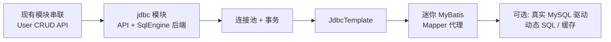

# stack4java 学习路线

> 个人后端技术栈学习项目，目标是用 Java 从零实现各类后端核心组件。

## 当前进度

| 模块 | 包路径 | 已实现能力 |
|------|--------|------------|
| HTTP | `http` | 自研 HTTP Server、Servlet、Filter、Session、RequestDispatcher |
| MVC | `mvc` | DispatcherServlet、路由注解、参数绑定、视图解析、全局异常 |
| Spring | `spring` | IoC/DI、AOP（ByteBuddy）、Bean 生命周期、ClassScanner |
| MySQL | `mysql` | 词法/语法解析、AST、Executor、内存 Catalog/Schema/Table |

`AppStarter` 已将 HTTP + Spring + MVC 串联，可在 8080 端口启动 Web 应用。

`mysql` 模块是**内存 SQL 引擎**（Lexer → Parser → AST → Executor），不是连接真实 MySQL 的 JDBC 客户端。

---

## 总体路线



---

## 第一步：把现有模块串成闭环（优先）

在写 JDBC / MyBatis 之前，先用已有组件做一个端到端 Demo：

```
HTTP 请求 → Controller → Service → Repository → SqlEngine
```

### 示例：User CRUD API

| 接口 | SQL |
|------|-----|
| `GET /api/users` | `SELECT * FROM user` |
| `POST /api/users` | `INSERT INTO user ...` |
| `PUT /api/users/{id}` | `UPDATE user SET ... WHERE id = ?` |
| `DELETE /api/users/{id}` | `DELETE FROM user WHERE id = ?` |

### 集成要点

- 将 `SqlEngine` 注册为 `DefaultBeanFactory` 中的单例 Bean
- Repository 通过 `@Autowired` 注入 `SqlEngine`
- Controller 调用 Service，Service 调用 Repository

### 为什么先做这步

1. 验证 HTTP / MVC / Spring / SQL 四层能协同工作
2. 提前暴露真实问题：Bean 管理、事务边界、异常如何返回 JSON
3. 为后续 JDBC、MyBatis 提供明确对照——「以前 Repository 直接调 SqlEngine，现在换成 SqlSession」

**预估工作量：** 1–2 天

---

## 第二步：实现 `jdbc` 模块

### 2.1 定义 JDBC 风格 API

建议目录结构：

```
jdbc/
  ├── DataSource.java
  ├── Connection.java
  ├── PreparedStatement.java
  ├── ResultSet.java
  └── RowMapper.java          // 借鉴 Spring JdbcTemplate
```

### 2.2 第一版后端：挂在自己的 SqlEngine 上

第一版不必引入真实 MySQL 驱动，底层仍走 `SqlEngine`：

```java
Connection conn = dataSource.getConnection();
PreparedStatement ps = conn.prepareStatement("SELECT * FROM user WHERE id = ?");
ps.setInt(1, 1);
ResultSet rs = ps.executeQuery();
```

**优势：**

- 完全可控，便于调试
- 理解 JDBC 每一层在做什么
- 与已有的 `mysql.ast.parser`、`Row` 天然衔接

### 2.3 连接池（迷你版）

不必一开始就仿 HikariCP，先做：

- 固定大小连接池
- `getConnection()` / `release()`
- 连接借还 + 简单超时

### 2.4 事务

利用已有 AOP 基础设施，增加 `@Transactional`：

- `Connection.setAutoCommit(false)`
- `commit()` / `rollback()`
- ThreadLocal 绑定「当前请求的 Connection」

Repository 从直接调 `SqlEngine` 改为通过 `Connection` 执行，这是走向 ORM 的关键过渡。

---

## 第三步：JdbcTemplate（MyBatis 的垫脚石）

在完整 MyBatis 之前，建议先实现轻量 `JdbcTemplate`：

```java
List<User> users = jdbcTemplate.query(
    "SELECT id, name, age FROM user WHERE age > ?",
    new Object[]{18},
    (rs, rowNum) -> new User(rs.getInt("id"), rs.getString("name"), rs.getInt("age"))
);
```

集中解决：

- SQL 参数绑定
- `ResultSet` → Java 对象映射
- 异常统一包装

有了这层，MyBatis 的 Mapper 代理就只是「把接口方法翻译成 Template 调用」。

---

## 第四步：实现迷你 `mybatis` 模块

已有 ByteBuddy AOP、ClassScanner、注解体系，做 MyBatis 核心条件成熟。

### 可复用的现有能力

| 组件 | 可复用 |
|------|--------|
| Mapper 接口代理 | ByteBuddy / JDK Proxy |
| Mapper 扫描注册 | `ClassScanner` |
| 依赖注入 | `@Autowired` + `DefaultBeanFactory` |
| 拦截器链 | 已有 AOP Advisor 机制 |

### MVP 范围（第一版）

1. `@Mapper` + `@Select` / `@Insert` / `@Update` / `@Delete`
2. `#{}` 参数占位（如 `WHERE id = #{id}`）
3. 结果映射：`@Results` 或按列名自动映射到 POJO
4. `SqlSessionFactory` + `SqlSession`（注册为 Bean）
5. `@MapperScan` 或扩展现有扫描逻辑

### 第一版暂不做

- 复杂动态 SQL（`<if>` / `<foreach>`）
- 二级缓存
- 插件体系
- XML Mapper

以上可在第二阶段逐步补充。

---

## 第五步（可选）：扩展与深化

- 增加 `RealMysqlDataSource`，适配真实 MySQL JDBC 驱动
- 动态 SQL 解析
- 一级 / 二级缓存简化实现
- Plugin 拦截器链
- 回到 `mysql` 模块：JOIN、索引、WAL、持久化（作为「数据库内核」专题）

---

## 不建议现在做的

| 方向 | 原因 |
|------|------|
| 继续深挖内存 SQL 引擎（JOIN、索引、WAL） | 有趣但偏离 JDBC/MyBatis 主线 |
| 直接引真实 MySQL 驱动开做 MyBatis | 能跑，但缺少「JDBC 每一层在干什么」的体感 |
| 一步仿完整 MyBatis | 范围太大，容易烂尾 |

---

## 如果只能选一个「下一步」

**做 User CRUD，把 SqlEngine 接进 Web 栈。**

完成后你会清楚：

- 还缺哪些抽象（Connection、Transaction、RowMapper）
- MyBatis 究竟在帮你省什么

然后再开 `jdbc` 包，目标明确：**让 Repository 从「直接调 SqlEngine」变成「通过 Connection / PreparedStatement」**。

---

## 参考：建议的包结构（后续阶段）

```
stack4java/src/main/java/
├── http/           # 已有
├── mvc/            # 已有
├── spring/         # 已有
├── mysql/          # 已有（内存 SQL 引擎）
├── jdbc/           # 待建：DataSource、Connection、连接池、事务
├── jdbc/template/  # 待建：JdbcTemplate
└── mybatis/        # 待建：Mapper 代理、SqlSession、注解 SQL
```
