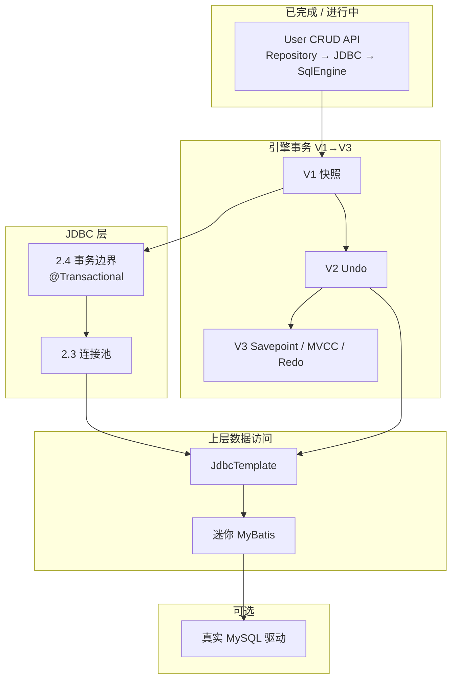

# stack4java 学习路线

> 个人后端技术栈学习项目，目标是用 Java 从零实现各类后端核心组件。

## 当前进度

| 模块 | 包路径 | 已实现能力 |
|------|--------|------------|
| HTTP | `http` | 自研 HTTP Server、Servlet、Filter、Session、RequestDispatcher |
| MVC | `mvc` | DispatcherServlet、路由注解、参数绑定、视图解析、全局异常 |
| Spring | `spring` | IoC/DI、AOP（ByteBuddy）、Bean 生命周期、ClassScanner |
| MySQL | `mysql` | 词法/语法解析、AST、Executor、DML/DQL/DDL、预处理 `?`、内存 Catalog/Schema/Table |
| JDBC | `jdbc` | DataSource / Connection / PreparedStatement / ResultSet（后端挂 SqlEngine） |

`AppStarter` 已将 HTTP + Spring + MVC + JDBC + SqlEngine 串联；`UserRepository` 经 JDBC 访问内存引擎，可在 8080 跑 User CRUD API。

`mysql` 模块是**内存 SQL 引擎**（Lexer → Parser → AST → Executor），不是连接真实 MySQL 的 JDBC 客户端。

**事务**：引擎层 `begin/commit/rollback` 尚未实现 → 见 [mini-MySQL 事务路线（V1→V2→V3）](./mini-mysql-transaction-roadmap.md)。

---

## 总体路线



**推荐主轴**：先把 **引擎事务 V1 + JDBC 衔接** 跑通，再做 **V2 Undo** 与 **连接池**，然后 **JdbcTemplate → MyBatis**；**V3（Savepoint / MVCC / Redo）** 与 MyBatis 可并行，但建议在 V2 稳定后做 MVCC/Redo。

---

## 第一步：Web 栈闭环（已基本完成）

```
HTTP 请求 → Controller → Service → Repository → JDBC → SqlEngine
```

### 示例：User CRUD API

| 接口 | SQL |
|------|-----|
| `GET /api/users` | `SELECT * FROM user` |
| `POST /api/users` | `INSERT INTO user ...` |
| `PUT /api/users/{id}` | `UPDATE user SET ... WHERE id = ?` |
| `DELETE /api/users/{id}` | `DELETE FROM user WHERE id = ?` |

### 后续可加强

- Repository / API 的自动化测试与断言
- 统一异常 → JSON（已有 `GlobalExceptionHandler` 可扩展）

---

## 第二步：JDBC 深化 + 引擎事务

> 引擎事务完整分版说明：[mini-mysql-transaction-roadmap.md](./mini-mysql-transaction-roadmap.md)

### 2.1 JDBC API（已有）

```
jdbc/
  ├── DataSource.java
  ├── Connection.java
  ├── PreparedStatement.java
  ├── ResultSet.java
  ├── RowMapper.java
  └── support/          # SqlEngine 后端实现
```

底层走 `SqlEngine.prepare()` + `PlaceholderResolver`，与 `mysql.ast.parser` 自然衔接。

### 2.2 引擎事务 V1：快照（优先）

在 **`mysql` 层**实现，不等到 MyBatis：

- `TransactionManager` + `CatalogSnapshot`
- `SqlEngine.beginTransaction()` / `commit()` / `rollback()`

详见事务文档 **V1** 章节与测试用例。

### 2.3 JDBC 事务衔接 + `@Transactional`

V1 完成后**立刻**做（不必等 V2）：

- `SqlEngineConnection.setAutoCommit(false)` → 调引擎 `begin`
- `commit()` / `rollback()` → 调引擎
- ThreadLocal 绑定「当前请求的 Connection」
- Spring `@Transactional`（复用 AOP）

**验收**：Service 内双 UPDATE「转账」全成功或全回滚。

### 2.4 连接池（迷你版）

在单连接事务跑通后：

- 固定大小池、`borrow` / `release`
- 每连接独立事务状态（为 V3.2 多事务做准备）

不必仿 HikariCP 全套。

### 2.5 引擎事务 V2：Undo 日志

- 替换 V1 快照为 `UndoTransactionManager`
- `TableService` 写路径挂 `UndoEntry`
- JDBC / Repository **无需改**

### 2.6 引擎事务 V3：Savepoint → MVCC → Redo

| 子阶段 | 内容 | 说明 |
|--------|------|------|
| **V3.1** | Savepoint | `ROLLBACK TO SAVEPOINT`，基于 Undo 栈 |
| **V3.2** | MVCC / Read View | 一致性读、RC 或 RR |
| **V3.3** | Redo + 持久化 | WAL、崩溃恢复、`mysql-data/` |

细节、步骤表、验收场景见 [事务路线 V3](./mini-mysql-transaction-roadmap.md#第三版进阶savepoint--mvcc--redo)。

---

## 第三步：JdbcTemplate（MyBatis 的垫脚石）

**建议时机**：引擎 **V2 Undo** 完成且 JDBC 事务已接好。

```java
List<User> users = jdbcTemplate.query(
    "SELECT id, name, age FROM user WHERE age > ?",
    new Object[]{18},
    (rs, rowNum) -> new User(rs.getInt("id"), rs.getString("name"), rs.getInt("age"))
);
```

集中解决：参数绑定、ResultSet → POJO、异常包装。MyBatis Mapper 代理 = 「接口方法 → Template 调用」。

---

## 第四步：迷你 `mybatis` 模块

已有 ByteBuddy、ClassScanner、IoC，条件成熟。

### MVP

1. `@Mapper` + `@Select` / `@Insert` / `@Update` / `@Delete`
2. `#{}` 占位
3. 结果映射到 POJO
4. `SqlSessionFactory` + `SqlSession`
5. `@MapperScan`

### 第一版暂不做

复杂动态 SQL、二级缓存、插件链、XML Mapper。

---

## 第五步（可选）：扩展

- `RealMysqlDataSource` + 官方驱动
- 动态 SQL、缓存、Plugin
- 引擎专题：JOIN、索引（与事务 V3 的 Redo/MVCC 互补，非替代）

---

## 如果只能选一个「下一步」

**做 [事务路线 V1 快照](./mini-mysql-transaction-roadmap.md#第一版快照事务snapshot)**，接着 **2.3 JDBC + @Transactional**。

完成后你会同时理解：

- 引擎里 commit/rollback 发生了什么
- JDBC `Connection` 与 Spring 事务如何挂上去
- 为何 V2 Undo 比 V1 快照更贴近 InnoDB

---

## 不建议现在做的

| 方向 | 原因 |
|------|------|
| 一步仿完整 MyBatis | 范围大；先有 JdbcTemplate + 稳定事务 |
| 跳过 V1/V2 直接 MVCC / Redo | 缺 Undo 与边界体感，难消化 |
| 直接引真实 MySQL 驱动做全部开发 | 可后期对接；前期应用 SqlEngine 便于调试 |
| 在 V2 前深挖 JOIN / 索引 | 可并行 hobby；**事务主线优先** |

---

## 参考：包结构

```
stack4java/src/main/java/
├── http/              # 已有
├── mvc/               # 已有
├── spring/            # 已有
├── mysql/             # 已有；transaction/ 待建（V1→V3）
├── jdbc/              # 已有；连接池、Savepoint API 待扩展
├── jdbc/template/     # 待建：JdbcTemplate
└── mybatis/           # 待建：Mapper、SqlSession
```

---

## 文档索引

| 文档 | 内容 |
|------|------|
| [learning-roadmap.md](./learning-roadmap.md) | 本文：Web → JDBC → Template → MyBatis |
| [mini-mysql-transaction-roadmap.md](./mini-mysql-transaction-roadmap.md) | 引擎事务 V1 快照 → V2 Undo → V3 Savepoint/MVCC/Redo |
