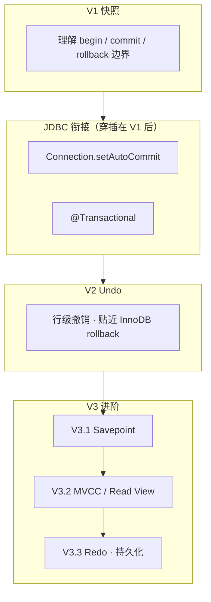

# mini-MySQL 事务学习路线：V1 快照 → V2 Undo → V3 进阶

> 面向本仓库 `mysql.*` 内存 SQL 引擎。按 **V1 → V2 → V3** 渐进实现引擎层事务，并与 **JDBC / `@Transactional`** 衔接；每一版替换或扩展 `TransactionManager` 实现，尽量不改 `Executor` 对外签名。

---

## 总览：三版分别学什么



| 版本 | 核心机制 | 你学会什么 | 预估工作量 |
|------|----------|------------|------------|
| **V1 快照** | BEGIN 时深拷贝 Catalog | 事务边界、原子 commit/rollback | 2–3 天 |
| **JDBC 衔接** | `Connection` 调引擎 begin/commit | 应用层事务、与 Spring 对齐 | 1–2 天 |
| **V2 Undo** | 写操作记录 `UndoEntry` | InnoDB 式回滚、为 MVCC 铺路 | 3–5 天 |
| **V3.1 Savepoint** | Undo 栈上的检查点 | 部分 rollback、嵌套业务 | 1–2 天 |
| **V3.2 MVCC** | Read View + 行版本链 | 隔离级别、一致性读 | 4–6 天 |
| **V3.3 Redo** | WAL + 刷盘 + 恢复 | durability、崩溃恢复 | 3–5 天 |

---

## 与真 MySQL（InnoDB）的对应

| 机制 | InnoDB 做什么 | 本路线 |
|------|---------------|--------|
| **整库快照** | 不使用 | **V1**（教学捷径） |
| **Undo log** | 回滚、MVCC 旧版本 | **V2** + **V3.2** |
| **Savepoint** | 部分回滚 | **V3.1** |
| **Read View / MVCC** | 一致性读、隔离级别 | **V3.2** |
| **Redo log** | WAL、宕机恢复 | **V3.3** |
| **行锁 / 间隙锁** | 写冲突、幻读控制 | 本路线不展开（可选专题） |

V1 的「快照」≠ InnoDB 的「快照读」；V3.2 的 Read View 才接近后者。

---

## 设计原则（V1–V3 共用）

1. **事务 API 与实现分离**  
   `TransactionManager` 接口稳定；V1/V2/V3 换实现或扩展，不改 `Executor.execute(Statement)` 签名。

2. **所有写操作只经 Service 层**  
   `Executor → TableService / SchemaService / CatalogService`。V2+ 在写路径挂 Undo；V3.2 在 Row 上挂版本信息。

3. **rollback / 存储替换后统一 rebind**  
   `EngineContext.rebindAfterStorageChange()`：刷新 `catalogService`、`schemaService`、`tableService` 指针。

4. **渐进放宽 MVP 约束**

   | 阶段 | 约束 |
   |------|------|
   | V1 | 单活跃事务；读未提交语义 |
   | V2 | 仍单活跃事务；Undo 仅用于 rollback |
   | V3.1 | 单事务内多 Savepoint |
   | V3.2 | 多事务并发读；简化为 RC 或 RR 二选一 |
   | V3.3 | 进程重启后可恢复已 commit 数据 |

---

## 建议包结构（随版本扩展）

```
mysql/core/transaction/
  TransactionManager.java
  Transaction.java
  SnapshotTransactionManager.java      # V1
  UndoTransactionManager.java          # V2
  CatalogSnapshot.java                 # V1
  UndoLog.java / UndoEntry.java        # V2
  undo/                                # V2：InsertUndo, UpdateUndo, ...
  SavepointManager.java                # V3.1
  ReadView.java                        # V3.2
  RowVersion.java                      # V3.2（或扩展 Row）
  RedoLog.java / RedoEntry.java        # V3.3
  RecoveryManager.java                 # V3.3
mysql/storage/
  CatalogStore.java                    # V3.3：可选持久化入口
```

---

# 第一版：快照事务（Snapshot）

### 目标

- `begin`：深拷贝当前 `Catalog` → `rollbackSnapshot`
- 事务内 SQL：照旧走 `Executor`（直接改内存）
- `commit`：丢弃快照
- `rollback`：用快照替换 `catalog` + `rebindAfterStorageChange()`

### 核心接口

```java
public interface TransactionManager {
    void begin(EngineContext ctx);
    void commit(EngineContext ctx);
    void rollback(EngineContext ctx);
    boolean isActive(EngineContext ctx);
}
```

```java
record Transaction(long id, Catalog rollbackSnapshot) {}
```

### CatalogSnapshot 拷贝范围

```
Catalog → Schema → Table → columns, primaryIdx, nextAutoIncrement, rows[].values[]
```

**必须**深拷贝 `Row.values`；不要与快照共享对象引用。

### V1 实施步骤

| 步骤 | 任务 | 验收 |
|------|------|------|
| 1 | `CatalogSnapshot.copy` / `restore` | 改原库不影响快照 |
| 2 | `SnapshotTransactionManager` | begin/commit/rollback 单测 |
| 3 | `EngineContext.activeTransaction` + `rebindAfterStorageChange` | rollback 后 SELECT 恢复 |
| 4 | `SqlEngine.beginTransaction / commit / rollback` | 见下方测试 |
| 5 | （可选）Parser：`BEGIN` / `COMMIT` / `ROLLBACK` | 与 API 并存 |
| 6 | **JDBC 衔接**（见下节） | 转账双 UPDATE 用例 |

### V1 测试

```sql
BEGIN;
INSERT INTO user (name, age) VALUES ('Alice', 20);
UPDATE user SET age = 99 WHERE name = 'Alice';
ROLLBACK;   -- 应无 Alice

BEGIN;
INSERT INTO user (name, age) VALUES ('Bob', 30);
COMMIT;     -- 应有 Bob
```

### V1 限制（下一版解决）

- begin 成本 O(整库)
- 无 Savepoint / 隔离级别
- SELECT 读未提交

---

# JDBC 衔接（建议在 V1 完成后立刻做）

与 [总路线 · 第二步 2.4](./learning-roadmap.md#24-事务) 对齐，**不必等 V2**。

```text
@Transactional
  → ThreadLocal<Connection>
  → setAutoCommit(false)  → SqlEngine.beginTransaction()
  → Repository 多条 SQL
  → commit / rollback     → SqlEngine.commit() / rollback()
```

| 步骤 | 任务 |
|------|------|
| 1 | `SqlEngineConnection.setAutoCommit / commit / rollback` |
| 2 | 首次 `execute` 且 `autoCommit=false` 时自动 `begin` |
| 3 | Spring `@Transactional` + AOP（复用现有 Advisor） |
| 4 | 验收：Service 内「减余额 + 加余额」要么全成功要么全回滚 |

**学习要点**：事务边界在 **Connection**，语义在 **SqlEngine**；V2/V3 换引擎实现时 Repository 可不动。

---

# 第二版：Undo 日志

### 目标

- `begin`：创建空 `UndoLog`（不再全库拷贝）
- 写操作：正向执行 + `undoLog.add(entry)`
- `commit`：清空 Undo（V3.2 起改为延迟 purge 供 MVCC）
- `rollback`：逆序 `UndoEntry.apply(ctx)`

### 核心结构

```java
interface UndoEntry { void apply(EngineContext ctx); }

class UndoLog {
    Deque<UndoEntry> entries;
    void add(UndoEntry e);
    void rollbackAll(EngineContext ctx);
    void clear();
}
```

### 写路径 Undo 对照

| 操作 | UndoEntry |
|------|-----------|
| insert | 按 PK 删行 |
| update | 恢复 old values |
| delete | 插回 Row 副本 |
| addColumn / dropColumn / dropTable | 反向 DDL |

### V2 实施步骤

| 步骤 | 任务 | 验收 |
|------|------|------|
| 1 | `UndoTransactionManager` 替换 Snapshot | 开关可切回 V1 对照 |
| 2 | DML 三类 Undo | V1 测试全过 |
| 3 | DDL Undo | ALTER / DROP TABLE rollback |
| 4 | 从 V1 迁移检查（见文末清单） | 无快照残留逻辑 |

### V1 → V2 迁移清单

- [ ] 写操作仅在 Service 层
- [ ] `TransactionManager` 单点注入
- [ ] `Executor` 无快照/Undo 逻辑
- [ ] JDBC 只调 `SqlEngine.commit/rollback`

---

# 第三版：进阶（Savepoint → MVCC → Redo）

> **依赖 V2 Undo**。Savepoint 最轻；MVCC 消费 Undo 链；Redo 解决持久化，可与 MVCC 并行但建议先 MVCC 再 Redo。

---

## V3.1 Savepoint（部分回滚）

### 目标

支持：

```sql
BEGIN;
UPDATE user SET age = 10 WHERE id = 1;
SAVEPOINT sp1;
UPDATE user SET age = 20 WHERE id = 1;
ROLLBACK TO sp1;   -- age 回到 10，sp1 之后语句撤销
COMMIT;
```

### 实现思路（基于 UndoLog）

**方案 A（推荐）**：Undo 栈上打标记

```text
UndoLog: [UpdateUndo, SavepointMark(sp1), UpdateUndo, InsertUndo, ...]

ROLLBACK TO sp1:
  从栈顶 pop 并 apply，直到 pop 到 SavepointMark(sp1)，停止（不撤销 mark 之前）
```

```java
record SavepointMark(String name) implements UndoEntry {
    void apply(EngineContext ctx) {
        throw new UnsupportedOperationException("mark 不可单独 apply");
    }
}
```

`SavepointManager.rollbackTo(name)` 负责 pop 到命名 mark。

**方案 B**：每个 Savepoint 复制 Undo 栈深度索引（实现更简单，内存略增）。

### 扩展接口

```java
void savepoint(EngineContext ctx, String name);
void rollbackToSavepoint(EngineContext ctx, String name);
void releaseSavepoint(EngineContext ctx, String name);  // 可选
```

Parser 增加：`SAVEPOINT ident` / `ROLLBACK TO [SAVEPOINT] ident` / `RELEASE SAVEPOINT ident`。

### V3.1 步骤

| 步骤 | 任务 | 验收 |
|------|------|------|
| 1 | `SavepointMark` + `SavepointManager` | 双 UPDATE 只回滚一段 |
| 2 | Parser / 或仅 API | SQL 或 Java 均可测 |
| 3 | JDBC `Connection.setSavepoint`（可选） | 与 SQL 对齐 |

---

## V3.2 MVCC 与 Read View（一致性读）

### 目标

- 写仍产生新版本，旧版本挂 **Undo 链**
- 每个事务有 **Read View**（活跃事务 id 集合、上下界）
- `SELECT` 根据 Read View 决定可见行版本（**不读别的事务未提交数据**）
- MVP：先实现 **Read Committed** 或 **Repeatable Read** 其一

### 行版本（扩展现有 Row）

```java
class RowVersion {
    Object[] values;
    long trxId;          // 创建/最后修改该版本的事务 id
    RowVersion undoLink;   // 指向更旧版本（或 Undo 索引）
}
```

或：`Table` 仍存「当前版本」，`UndoLog` 全局保留已提交事务的旧版本直到 purge（教学简化）。

### Read View（示意）

```java
record ReadView(
    long creatorTrxId,
    long minTrxId,
    long maxTrxId,
    Set<Long> activeTrxIds
) {
    boolean isVisible(long rowTrxId);
}
```

- **RR**：Read View 在**第一次 SELECT** 或 **BEGIN** 时创建，事务内不变
- **RC**：每条 SELECT 新建 Read View

### SELECT 路径改动

```text
TableService.select
  → 对每个 Row，从最新版本沿 undoLink 找第一个 isVisible 的版本
  → 投影 / WHERE / ORDER BY 基于可见版本
```

### commit 与 purge

- **commit**：事务 id 加入「已提交」；Undo 链**暂不删**（供其他事务读旧版本）
- **purge**（后台简化）：无事务再需要更旧版本时，删除 Undo 节点

### V3.2 步骤

| 步骤 | 任务 | 验收 |
|------|------|------|
| 1 | 全局 `trxId` 分配器；`Transaction` 带 `trxId` | 每事务唯一 id |
| 2 | 写路径：update 写新版本 + 链旧版本 | 可沿链读到旧值 |
| 3 | `ReadView` + `isVisible` | 单测 visibility 规则 |
| 4 | `select` 读可见版本 | 事务 A 未提交，B 看不见 |
| 5 | RC 或 RR 二选一 | 经典脏读/不可重复读 demo |
| 6 | 简化的 purge | 长事务不无限涨 Undo |

### 经典验收场景

```text
A: BEGIN; UPDATE user SET age=99 WHERE id=1;   -- 未 commit
B: BEGIN; SELECT age FROM user WHERE id=1;   -- 应仍为旧值（非 99）
A: COMMIT;
B: SELECT ...                               -- RC: 读到 99；RR: 看 B 何时建 ReadView
```

---

## V3.3 Redo 日志（持久化与崩溃恢复）

### 目标

- **已 commit** 的修改在进程重启后仍在
- 采用 **WAL**：先写 Redo，再改内存页（此处「页」= Table/Row）
- 崩溃后：**Redo 重做** 已 commit 未刷盘的操作；**Undo** 仍负责未 commit 事务 rollback

### 与 Undo 分工（InnoDB 同款思路）

| 日志 | 作用 |
|------|------|
| Undo | 回滚、MVCC 旧版本 |
| Redo | 持久化、crash recovery |

### 简化 Redo 条目

```java
interface RedoEntry {
    void redo(EngineContext ctx);   // 重做
    byte[] serialize();
    static RedoEntry deserialize(byte[] bytes);
}
```

示例：`InsertRedo(table, pk, values)`、`UpdateRedo(table, pk, newValues)`。

### 写路径（两阶段）

```text
1. 写 RedoLog（append only，顺序写文件 mysql-data/redo.log）
2. 改内存（TableService 照常）
3. commit 时：标记 redo 所属 trx 为 committed，fsync（或 group commit 简化版）
4. rollback 时：内存 Undo 恢复；Redo 中该 trx 标记 aborted（recovery 跳过）
```

### 启动恢复

```text
RecoveryManager.recover():
  读 redo.log → 找到 committed 且可能未完全 apply 的条目 → redo()
  （MVP：内存即 truth，redo 仅用于「重启后重建 catalog」）
```

更简 MVP：**checkpoint** — 定期把整库 `CatalogSnapshot` 写盘 + redo 只记增量。

### 持久化布局（建议）

```
mysql-data/
  redo.log          # append only
  checkpoint.snapshot   # 可选：全量 checkpoint
  meta.properties   # 下一个 trxId、log 偏移
```

### V3.3 步骤

| 步骤 | 任务 | 验收 |
|------|------|------|
| 1 | `RedoLog` append + 序列化 | 重启前写盘可读 |
| 2 | DML 写路径：先 redo 再改内存 | 日志与内存一致 |
| 3 | `commit` 写 commit marker + fsync | kill 进程后 committed 数据在 |
| 4 | `RecoveryManager` 启动恢复 | 未 commit 的不出现 |
| 5 | （可选）checkpoint 降低恢复时间 | 大表可接受 |

---

## 三版对比（含 V3）

| 维度 | V1 快照 | V2 Undo | V3.1 SP | V3.2 MVCC | V3.3 Redo |
|------|---------|---------|---------|-----------|-----------|
| begin 成本 | O(库) | O(1) | O(1) | O(1) | O(1) |
| rollback | O(库) | O(写入) | O(至 SP) | 同 V2 | 同 V2 |
| 一致性读 | 无 | 无 | 无 | 有 | 有 |
| 持久化 | 无 | 无 | 无 | 可选 | 有 |
| 贴近 InnoDB | 低 | 中 | 中 | 高 | 高 |

---

## 推荐学习顺序（丝滑版）

与 [总路线](./learning-roadmap.md) 第二步、第三步交叉进行：

| 顺序 | 做什么 | 文档章节 |
|------|--------|----------|
| 1 | 读 InnoDB：Undo/Redo/MVCC 分工 | 本文「与 InnoDB 对应」 |
| 2 | **V1 快照** + 引擎 API 测试 | V1 |
| 3 | **JDBC + @Transactional** | JDBC 衔接 |
| 4 | 连接池（总路线 2.3） | learning-roadmap 2.3 |
| 5 | **V2 Undo**（DML → DDL） | V2 |
| 6 | **V3.1 Savepoint** | V3.1 |
| 7 | **V3.2 MVCC**（先 RR 或 RC） | V3.2 |
| 8 | **V3.3 Redo** + 重启恢复 | V3.3 |
| 9 | JdbcTemplate → MyBatis | learning-roadmap 第三、四步 |

**原则**：先 **边界**（V1+JDBC）→ 再 **回滚机制**（V2）→ 再 **隔离与持久化**（V3）；MyBatis 不阻塞引擎事务深挖，但 **JdbcTemplate 应在 V2 之后**，此时事务语义已稳定。

---

## 相关代码入口

- `mysql/core/EngineContext.java`
- `mysql/core/SqlEngine.java`
- `mysql/service/TableService.java`
- `jdbc/support/SqlEngineConnection.java`
- `spring/service/UserRepository.java`

## 相关文档

- [stack4java 总路线](./learning-roadmap.md)
